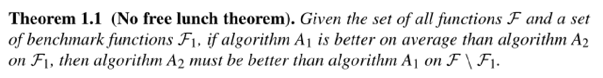
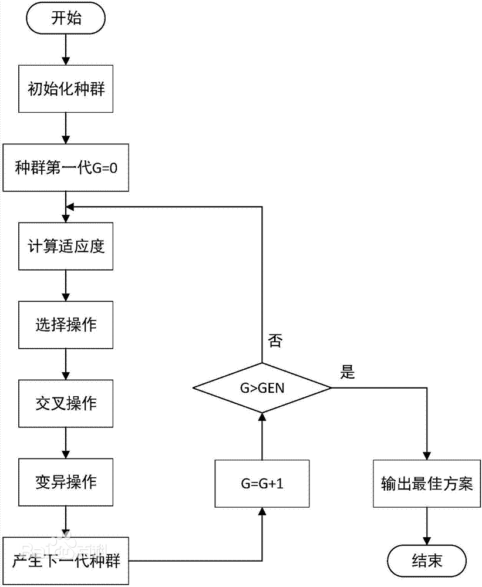
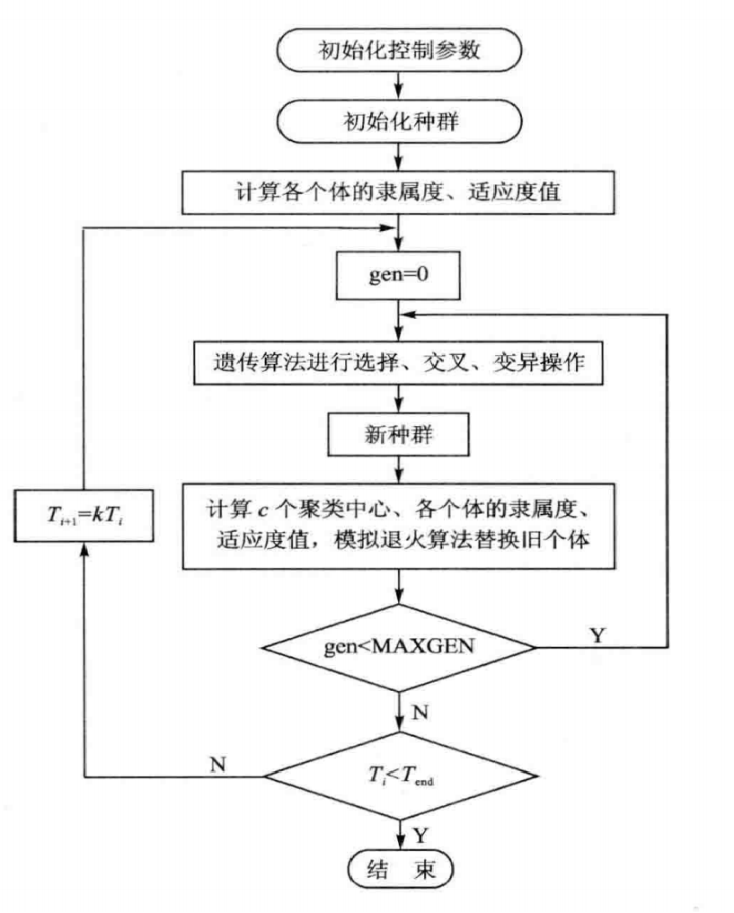

# 智能优化算法

**以下内容仅个人理解，如果有错误的请联系我。**

# 导论

1. Continuous Optimization vs Discrete Optimization(连续优化vs离散优化)
   + 优化问题可以是连续的(无穷多个可行解)或组合的(有限个可行解)
   + 连续优化问题通常来讲最小化或最大化连续变量的函数解，例如最小化$4x+5y$其中$x$和$y$是实数。
   + 组合优化问题通常来讲最小化或最大化连续离散的函数解，例如最小化$4x+5y$其中$x$和$y$是整数。
   + 通常来讲组合优化问题会更加困难，因为没有导数信息并且函数曲面也不光滑。
   
2. Polynomial vs Exponential-Time Algorithms(多项式时间复杂度vs指数时间复杂度)
   + 多项式级别的算法的复杂度是由限定多项式其最高位的项决定的，这种复杂度的算法是可以接收的因为它是可以处理大数据。
   + 在指数时间算法下，运行时间为一个指数级别的函数决定，运行时间随着指数增长。
   + 多项式时间复杂度比指数时间复杂度好：因为指数级别的时间复杂度具有指数爆炸增长的性质
   
3. optimal solution near-optimal solution(最优解和近似最优解)
   + 最优解：最优解是值最佳的函数目标值
   + 近似最优解：是客观的优秀的目标值，但是不一定是最佳的。
   
4. Meta-Heuristics(元启发式)

   元启发式算法是相对于最优化算法提出来的，一个问题的最优化算法可以求得该问题的最优解，而元启发式算法是一个基于直观或经验构造的算法，它可以在可接受的花费(指计算时间和空间)下给出问题的一个可行解，并且该可行解与最优解的偏离程度不一定可以事先预计。

5. optimization problem(优化问题)

   优化是决策的重要工具，用数学方法来说优化问题就是在所有可行解中找到最佳解的问题。

6. No free lunch theorem(没有免费午餐定理)

   

   没有免费午餐定理表达的内容就是：**世界上不存在一个普适的模型，每个模型都有其特定的适用范围。**

# Genetic Algorithm(遗传算法)

## 遗产算法执行过程

​		遗传算法是从代表问题可能潜在的解集的⼀个种群（population）开始的，而⼀个种群则由经过基因（gene）编码的⼀定数目的个体(individual)组成。每个个体实际上是染色体(chromosome)带有特征的实体。
​		染⾊体作为遗传物质的主要载体，即多个基因的集合，其内部表现（即基因型）是某种基因组合，它决定了个体的形状的外部表现，如⿊头发的特征是由染⾊体中控制这⼀特征的某种基因组合决定的。因此，在⼀开始需要实现从表现型到基因型的映射即编码⼯作。由于仿照基因编码的⼯作很复杂，我们往往进⾏简化，如⼆进制编码。
​		初代种群产⽣之后，按照适者⽣存和优胜劣汰的原理，逐代（generation）演化产⽣出越来越好的近似解，在每⼀代，根据问题域中个体的适应度（fitness）大小选择（selection）个体，并借助于⾃然遗传学的遗传算⼦（genetic operators）进⾏组合交叉（crossover）和变异（mutation），产⽣出代表新的解集的种群。
这个过程将导致种群像⾃然进化⼀样的后⽣代种群⽐前代更加适应于环境，末代种群中的最优个体经过解码（decoding），可以作为问题近似最优解。

## 遗传算法流程图

## 算法参数

+ **Encoding  Encoding precision(编码和编码精度)：**

  **编码：**编码值的是将问题的候选解用染色体表示，实现解空间向编码空间的映射过程。

  常用的编码有二进制编码和浮点数编码。

  **编码精度：**编码精度指的是连续函数映射到离散化的误差。

  例如：一段连续的区间从0到4 $x \in [0, 4]$

  使用6为二进制数进行编码则

  $[0 \enspace 0 \enspace 0 \enspace 0 \enspace 0 \enspace 0] = 0$

  $[1 \enspace 1 \enspace 1 \enspace 1 \enspace 1 \enspace 1] = 4$

  使用6为二进制数进行编码可以表示63个数字则编码精度为$ \frac{4}{63}$

+ **Fitness(适应度)** 

   适应度是一种特殊类型的函数，用于量化解的最优性。衡量某个基因型个体的繁殖能力

+ **Selection(选择)**

  选择的作用是优胜劣汰，适者生存。

  选择体现了适者生存的原则，为遗传算法提供了一种驱动力，基于个体的适应性。

  两种选择方法：Roulette Wheel selection(轮盘赌)和Stochastic-universal selection(随机通用选择)

+ **Crossover(交叉)**

  交叉是在随机选择的两条父染色体之间交换信息，并产生两个新的后代。

  交叉的作用：保证种群的稳定性，朝着最优解的方向进化。

+ **Mutation(变异)**

  基因突变是染色体的某一个位点上基因的改变。基因突变使一个基因变成它的等位基因，并且通常会引起一定的表现型变化。正如上面所说，二进制编码的遗传操作过程和生物学中的过程非常相类似，基因串上的“ 0”或“ 1”有一定几率变成与之相反的“ 1”或“ 0”。

+ **Reinsertion**

  如果产生的后代少于原始种群的数量，则为了保持原始种群的数量，必须将后代重新插入老年种群。

# Simulated Annealing(SA) Algorithm

## Hill climbing(爬山法)

**定义：**从当前的节点开始，和周围的邻居节点的值进行比较。 如果当前节点是最大的，那么返回当前节点，作为最大值(既山峰最高点)；反之就用最高的邻居节点来，替换当前节点，从而实现向山峰的高处攀爬的目的。如此循环直到达到最高点。

**优点：**

1. 避免遍历，通过启发选择部分节点，从而达到提高效率的目的。

**缺点：**

1. 局部最大：某个节点比周围任何一个邻居都高，但是它却不是整个问题的最高点。
1. 局部最优取决于初始配置
2. 通常无法确定迭代上限

## SA算法原理

​		模拟退火算法(Simulated Annealing, SA)的思想借鉴于固体的退火原理，当固体的温度很高的时候，内能比较大，固体的内部粒子处于快速无序运动，当温度慢慢降低的过程中，固体的内能减小，粒子的慢慢趋于有序，最终，当固体处于常温时，内能达到最小，此时，粒子最为稳定。模拟退火算法便是基于这样的原理设计而成。

## SA算法流程

当温度$T$大于指定温度$T_{min}$：

​	$x$是当前的位置$x^{'}$是新的位置的指

​	接受的可能性为$p=e^{\frac{f(x) - f(x^{'})}{T}}$

​	随机一个值$r \in (0, 1)$

​	如果$f(x^{'}) < f(x)$则说明新的位置更优，无条件转移到$x^{'}$

​	否则如果$f(x^{'}) \ge f(x)$则说明新的位置不会更优，当$r<p$时转移到$x^{'}$

​	更新温度$T$

**算法流程图**

## SA算法关键参数说明

$T$：初始温度。

$L$：Markov链长，即等温条件下进行迭代得次数。

**状态产生函数**：设计状态产生函数应该考虑到尽可能地保证所产生的候选解遍布全部解空间。一般情况下状态产生函数由两部分组成，即产生候选解的方式和产生候选解的概率分布。候选解的产生方式由问题的性质决定，通常在当前状态的邻域结构内以一定概率产生。

**退温函数**：退温函数即温度更新函数，用于在外循环中修改温度值。目前，最常用的温度更新函数为指数退温函数， 即$T(n+1) =KT(n)$ ， 其中$0<K < 1$是一个非常接近于1的常数。

**算法停止准则**：算法停止准则用于决定算法何时结束。可以简单地设置温度终值$F$，当$T=F$，时算法终止。

## SA算法的特点

1. SA是一种通用的解决方法，很容易适用于解决数据量大得问题。
2. 参数调整容易
3. SA算法得到得结果相对较优，尽管会花费一些时间
4. 结果通常不可重复：即多次运行的结果可能不相同
5. SA算法会找到一个最优解后可能不会再次找到它，所以需要记录到目前为止的最优解。

## **k**-means algorithm

**原理：**在给定K值和K个初始类簇中心点的情况下，把每个点(亦即数据记录)分到离其最近的类簇中心点所代表的类簇中，当类簇中心点的变化很小，或者达到指定的迭代次数时算法结束。

**优点：**

1. 原理比较简单，实现也是很容易，收敛速度快。
2. 聚类效果较优。

**缺点：**

1. 依赖随机化的初始值这表示算法结果取决于初始随机种子，默认情况下进行10次不同的随机初始值并返回最优的值。

**改进方式：**将k-means和SA算法结合在一起可以改进结果取决于初始随机种子的情况

k-means和SA算法结合的流程图

# Ant Colony Optimization Algorithm(蚁群算法)

**Swarm intelligence (群体智能)：**群体智能是分布式的、自组织的自然或人工系统的集体行为。SI系统通常由一群简单个体组成，这些个体之间相互作用并于环境相互作用。个体遵守非常简单的规则，个体的行为一定程度上甚至是随机的，但是通过个体之间的交互使得群体表现出了一种智能的行为，而个体不知道这种行为。

​		蚁群算法（Ant Clony Optimization，ACO）是一种群智能算法，它是由一群无智能或有轻微智能的个体（Agent）通过相互协作而表现出智能行为，从而为求解复杂问题提供了一个新的可能性。蚁群算法最早是由意大利学者Colorni A., Dorigo M. 等于1991年提出。

​		蚁群算法是一种仿生学算法，是由自然界中蚂蚁觅食的行为而启发的。在自然界中，蚂蚁觅食过程中，蚁群总能够按照寻找到一条从蚁巢和食物源的最优路径。

## 蚁群算法理论

​		**蚁群算法的信息交互主要是通过信息素来完成的**。蚂蚁在运动过程中，能够感知这种物质的存在和强度。初始阶段，环境中没有信息素的遗留，蚂蚁寻找事物完全是随机选择路径，随后寻找该事物源的过程中就会受到先前蚂蚁所残留的信息素的影响，其表现为蚂蚁在选择路径时趋向于选择信息素浓度高的路径。

蚁群算法的基本原理:

1. 蚂蚁在路径上释放信息素。
2. 碰到还没走过的路口，就随机挑选一条路走。同时，释放与路径长度有关的信息素。
3. 信息素浓度与路径长度成反比。后来的蚂蚁再次碰到该路口时，就选择信息素浓度较高路径。
4. 最优路径上的信息素浓度越来越大。
5. 最终蚁群找到最优寻食路径。

## 蚁群算法关键参数

**参数表示：**

+ $m$：蚂蚁数量

+ $k$：蚂蚁编号

+ $n$：城市数

+ $d_{ij}$：城市$(i, j)$之间距离

+ $\eta_{ij}$：启发式因子(能见度)，放映蚂蚁由城市$i$转移到城市$j$的启发程度。

  计算公式：$\eta_{ij} = \frac{1}{d_{ij}}$

+ $\rho$：信息素挥发系数

+ $\Delta \tau_{ij}^{k}$：第$k$只蚂蚁在本次迭代边$(i, j)$信息素的增量

  计算公式：
  $$
  \Delta \tau_{ij}^{k} = 
  \left \{
  \begin{array}{ll}
  \frac{Q}{L^k}, 如果第k只蚂蚁经过边(i, j) \\
  0, 否则
  \end{array}
  \right.
  $$
  其中$Q$为一个常数$L$表示路径$(i,j)$的长度

+ $\Delta \tau_{ij}(t)$：本次迭代边$(i, j)$信息素的增量

  计算公式：$\Delta \tau_{ij}(t) = \sum\limits_{k=1}^{n} \tau_{ij}(t)$

+ $\tau_{ij}$：边$(i,j)$上的信息素

  $t+1$时刻信息素的计算公式：$\tau_{ij}(t+1) = (1-\rho) \tau_{ij}(t) + \Delta \tau_{ij}(t)$

+ $P_{ij}^{k}(t)$：在$t$时刻蚂蚁$k$由城市$i$转移到城市$j$的概率

  概率转移的计算公式：
  $$
  P_{ij}^{k}(t)=
  \left \{
  \begin{array}{ll}
  \frac{[\tau_{ij}(t)]^{\alpha}[\eta_{ij}(t)]^{\beta}}{\sum\limits_{l \in N_i^{k}(t)}[\tau_{il}]^{\alpha}[\eta_{il}(t)]^{\beta}} &, j\in N_i^{k}(t)
  \\
  0 & j \notin N_i^k(t)
  \end{array}
  \right.
  $$
  其中$N_{i}^{k}(t)$表示$t$时刻第$k$只蚂蚁在第$i$个城市能到达的城市的集合$\alpha$和$\beta$为两个常数

## 蚁群算法流程图

# Tabu Search(禁忌搜索)	

​		首先我们先看看爬山法，从当前的节点开始，和周围的邻居节点的值进行比较。如果当前节点是最大的，那么返回当前节点，作为最大值(即山峰最高点)；反之就用最高的邻居节点替换当前节点，从而实现向山峰的高处攀爬的目的。爬山法有很多缺点，不容易找到全局最优解，为了找到“全局最优解”，就不应该执着于某一个特定的区域。于是人们对局部搜索进行了改进，得出了禁忌搜索算法。

​		禁忌(Tabu Search)算法是一种元启发式(meta-heuristic)随机搜索算法，它从一个初始可行解出发，选择一系列的特定搜索方向(移动)作为试探，选择实现让特定的目标函数值变化最多的移动。为了避免陷入局部最优解，TS搜索中采用了一种灵活的“记忆”技术，对已经进行的优化过程进行记录和选择，指导下一步的搜索方向，这就是Tabu表的建立。

​		基于记忆的搜索是禁忌搜索算法的特点。

## 禁忌搜索算法流程

1. 初始化
    利用贪婪算法等局部搜索算法生成一个初始解，清空禁忌表，设置禁忌长度

2. 邻域搜索产生候选解
    根据步骤1产生初始解，通过搜索算子（search operators），如relocation、exchange、2-opt等，产生候选解(candidate solution)，并计算各个候选解的适应值（即解对应的目标函数值）

3. **选择最好的候选解**
   从步骤2产生的所有候选解中选出适应值最好的候选解，将其与当前最好解(即搜索算法开始到现在找到的最好解)进行比较
   如果优于当前最好解，那么就不考虑其是否被禁忌，用这个最好的候选解来更新当前最好解，并且作为下一个迭代的当前解，然后将对应的操作加入禁忌表；
   如果不优于当前最好解，就从所有候选解中选出不在禁忌状态下的最好解作为新的当前解，然后将对应操作加入禁忌表。

4. 判断终止条件

   若满足终止条件，则立即停止并输出当前最好解；否则继续搜索。
    一般终止条件为是否到达一定的迭代次数或者达到了一个时间限制。

**流程图**：

# Particle Swarm Optimization Algorithm(粒子群算法)

​		PSO模拟的是鸟群的捕食行为。设想这样一个场景：一群鸟在随机搜索食物。在这个区域里只有一块食物。所有的鸟都不知道食物在那里。但是他们知道当前的位置离食物还有多远。那么找到食物的最优策略是什么呢。最简单有效的就是搜寻目前离食物最近的鸟的周围区域。

​		鸟群在整个搜寻的过程中，通过相互传递各自的信息，让其他的鸟知道自己的位置，通过这样的协作，来判断自己找到的是不是最优解，同时也将最优解的信息传递给整个鸟群，最终，整个鸟群都能聚集在食物源周围，即找到了最优解。

​		PSO中，每个优化问题的解都是搜索空间中的一只鸟。我们称之为“粒子”。所有的粒子都有一个由被优化的函数决定的适应值(fitness value)，每个粒子还有一个速度决定他们飞翔的方向和距离。然后粒子们就追随当前的最优粒子在解空间中搜索。

​		PSO初始化为一群随机粒子(随机解)。然后通过迭代找到最优解。在每一次迭代中，粒子通过跟踪两个"极值"来更新自己。第一个就是粒子本身所找到的最优解，这个解叫做个体极值pBest。另一个极值是整个种群目前找到的最优解，这个极值是全局极值gBest。另外也可以不用整个种群而只是用其中一部分作为粒子的邻居，那么在所有邻居中的极值就是局部极值。

